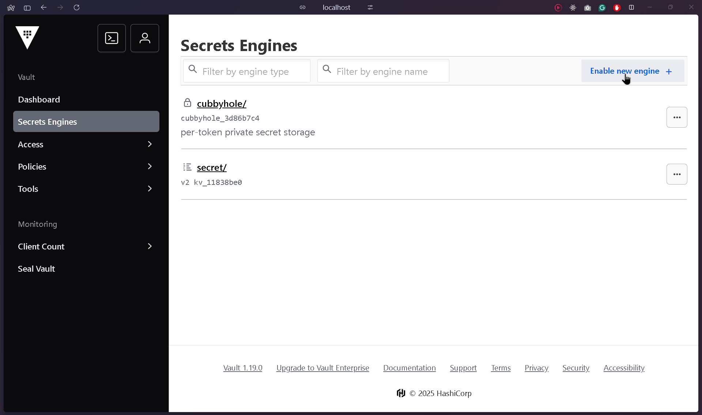

<div align="center">
<h1>goAIRA (Automated Issue Reporting Assistant)</h1>
 A lightweight Go backend application that automates issue reporting using exposed REST APIs. It is an ideal tool for mid-sized to large organizations where sharing API tokens or other credentials poses a security risk.
</div>

## Pre-requisits :

| Application | Resource | Usecase |
|-------------|----------|---------|
| Go | [Reference](https://go.dev/doc/install) | |
| docker | [Reference](https://docs.docker.com/engine/install/) | Provides a local environment for containorized code |
| Git | [Reference](https://git-scm.com/downloads) | For version control |
| Postman | [Reference](https://www.postman.com/downloads/) | For API testing |
| DBeaver | [Reference](https://dbeaver.io/download/) | For connecting to db |

> <b>Note</b> : You can use any API testing tool instead of postman as long as you are sending required headers and body content as part of API call

## Setup :

<details>
    <summary><text style="font-size: 16px;">Setup using docker-compose file ( Quick setup )</text></summary>

1. Create a file named "docker-compose.yml" and copy celow code in it .

```yaml
services:
  db:
    image: postgres
    restart: always
    environment:
      POSTGRES_USER: admin   # Default user , update as per requirement
      POSTGRES_PASSWORD: admin  # Default pass , udate as per requirement
      POSTGRES_DB: goaira
    volumes:
      - pgdata:/var/lib/postgresql/dat
    ports:
      - "5432:5432"

  goAIRA:
    image: rebelnato/goaira:latest
    restart: always
    env_file:
      - .env
    ports:
      - "8080:8080"  # Will be assigned 8090 as internal docker port and 8080 for localhost

  vault:
    image: hashicorp/vault:latest
    pull_policy: always
    container_name: vault
    restart: always
    ports:
      - "8300:8200"  # Vault API port
    cap_add:
      - IPC_LOCK  # Prevent memory from being swapped to disk (security best practice)
    environment:
      VAULT_ADDR: "http://0.0.0.0:8200"
      VAULT_API_ADDR: "http://localhost:8200"
      VAULT_CLUSTER_ADDR: "http://localhost:8201"
      VAULT_LOCAL_CONFIG: |
        {
          "listener": [{
            "tcp": {
              "address": "0.0.0.0:8200",
              "tls_disable": 1
            }
          }],
          "storage": {
            "file": {
              "path": "/vault/data"
            }
          },
          "ui": true
        }
    volumes:
      - vault_data:/vault/data  # Persistent storage
    command: server  # Start Vault in server mode

volumes:
  vault_data:
    driver: local
  pgdata:
```
2. Create `.env` file in parent directory .
> i.e : If you are cloning repository inside `path/goAIRA` then location of `.env` file should be `path/goAIRA/.env` .
3. Move inside the parent directory ex : `path/goAIRA` using terminal and run `docker-compose up -d --build` .
4. Wait for the task to complete . Once completed use any API test tool to validate on exposed APIs or goto `http://localhost:8080/` in any browser of your choice ( preferrably chrome or ARC ) .
5. If the `/health` endpoints returns vault status as true then we are ready for vault initialization .
6. Run below command to modify ownership and permission for `/vault` folder .
```bash
docker exec -it vault sh -c "chown -R 100:100 /vault && chmod -R 750 /vault"
```
7. Run below command to initiate vault , which will return 5 unseal key and 1 token key . Store the keys safe as we will need the in next steps to unseal vault and login.
```bash
docker exec -it vault vault operator init

Sample output:

Unseal Key 1: <unseal_key_1>
Unseal Key 2: <unseal_key_2>
Unseal Key 3: <unseal_key_3>
Unseal Key 4: <unseal_key_4>
Unseal Key 5: <unseal_key_5>

Initial Root Token: <Root key>
```
8. Add the `Root key` in `.env` and rebuild the containers using below commands.
```bash
docker-compose down
docker-compose up -d --build
```
><b>Note :</b> Doing this will add `Root key` as environment variable of your docker container . Same will be utilized for authentication later.
9. Once you have added `Root` key in .env file and rebuilt the container , run provided command to unseal vault.
```bash
docker exec -it vault vault operator unseal <unseal_key_1>
docker exec -it vault vault operator unseal <unseal_key_2>
docker exec -it vault vault operator unseal <unseal_key_3>
```
10. Goto `http://localhost:8300` and use root key capture while initiating vault to login.
11. Create a new secret engine name `secret` .

12. Create 2 new secrets `SNOW` and `SNOW_refresh` inside `secret` engine .

13. Store below mentioned creds in associated secrets.
`SNOW` :
```json
{
  "client_id": "<ServiceNow client id>",
  "client_secret": "<Client password>",
  "password": "<ServiceNow users password>",
  "username": "<ServiceNow user name>"
}
```

`SNOW_refresh` :
```json
{
  "refresh_epoch_time": 0,
  "refresh_token": "<Keep it as "" , it will automatically be updated with appropriate vaule>"
}
```


</details>

<details>
    <summary><text style="font-size: 16px;">Setup using github clone ( for more of a personalised setup )</text></summary>

1. Clone [goAIRA](https://github.com/rebelnato/goAIRA) git repository to local .
```bash
git clone https://github.com/rebelnato/goAIRA.git
```
2. Create `.env` file in parent directory .
> i.e : If you are cloning repository inside `path/goAIRA` then location of `.env` file should be `path/goAIRA/.env`
3. Add `Vault_pass` attribute inside `.env` file . We'll update the vault token in here so that same can be added as environment variable in docker container.
The keys will generate in step 7.
```bash
Vault_pass=<vault access token>
Vault_unsealKey1=<vault unseal key 1>
Vault_unsealKey2=<vault unseal key 2>
Vault_unsealKey3=<vault unseal key 3>
Vault_unsealKey4=<vault unseal key 4>
Vault_unsealKey5=<vault unseal key 5>

db_user=<db user_name>
db_pass=<db pass>
db_name=<db name>
```
4. Create `config.yml` file in parent directory , same as `.env` file . Add servicenow endpoints and consumer ids in the yaml file.
```yaml
endpoints:
  servicenow:  
    base: "https://<your-instance-id>.service-now.com/"
  vault:
    addr1: "localhost:8300"
    addr2: "vault:8200"
  db_host:
    host1: "localhost"
    host2: "db"

 enableDb: true # To enable or disable db function
```
5. Use below command to build and run docker container utilizing config of `docker-compose.yml` file .
```bash
docker-compose up -d --build
```
`-d` : Runs conatiner in background.

`--build` : Forces docker image rebuild before container starts.

6. Run below command to modify ownership and permission for `/vault` folder .
```bash
docker exec -it vault sh -c "chown -R 100:100 /vault && chmod -R 750 /vault"
```
7. Run below command to initiate vault , which will return 5 unseal key and 1 token key . Store the keys safe as we will need the in next steps to unseal vault and login.
```bash
docker exec -it vault vault operator init

Sample output:

Unseal Key 1: <unseal_key_1>
Unseal Key 2: <unseal_key_2>
Unseal Key 3: <unseal_key_3>
Unseal Key 4: <unseal_key_4>
Unseal Key 5: <unseal_key_5>

Initial Root Token: <Root key>
```
8. Add the `Root key` and `Unseal keys` in `.env` and rebuild the containers using below commands.
```bash
docker-compose down
docker-compose up -d --build
```
><b>Note :</b> Doing this will add `Root key` as environment variable of your docker container . Same will be utilized for authentication later.
9. Once you have added `Root` and `Unseal` keys in .env file and rebuilt the container , run provided command to unseal vault.
```bash
.\/vault/vaultUnseal.sh
```
10. Goto `http://localhost:8200` and use root key capture while initiating vault to login.
11. Create a new secret engine name `secret` .

12. Create 2 new secrets `SNOW` and `SNOW_refresh` inside `secret` engine .

13. Store below mentioned creds in associated secrets.
`SNOW` :
```json
{
  "client_id": "<ServiceNow client id>",
  "client_secret": "<Client password>",
  "password": "<ServiceNow users password>",
  "username": "<ServiceNow user name>"
}
```

`SNOW_refresh` :
```json
{
  "refresh_epoch_time": 0,
  "refresh_token": "<Keep it as "" , it will automatically be updated with appropriate vaule>"
}
```


</details>

## Exposd APIs :

> Below table contains list of exposed APIs by goAIRA program and required headers for APIs.

| Endpoint | Method | Required Headers | Use case |
|----------|--------|------------------|----------|
| `/health` | `GET` | No headers required | Return program health along with vault connection status |
| `/createincident` | `POST` | `cosumerid , shortDesc , desc , caller , channel , impact , urgency` | Can be used for creating new SNOW incident |
| `/getincident` | `GET` | `consumerid , incidentNum` | Get incident details |
| `/updateincident` | `PATCH` | `consumerid , incidentNum` <br> <b>`Optional headers:`</b> <br> `CloseNotes (For providing resolution notes)` <br> `CloseCode (Mandatory field while resolving incident , ex: "User error")` <br> `ShortDescription` <br> `Comment` <br> `WorkNote` <br> `Description` <br> `AssignmentGroup` <br> `Status ( For updating status of the incident , available options 1-New , 2-In Progress , 6-Resoolved )` | Can be used to update existing incident details including incident short description , description , assignment or state of incident |

## Sample responses :

1. `/health` :

```json
{
    "dbStatus": true,
    "server": "pong",
    "vault": true
}
```

2. `/createincident` :

```json
{
    "data": {
        "incidentURL": "https://<your-instance-id>.service-now.com/now/nav/ui/classic/params/target/incident.do%3Fsys_id%<sys_id>",
        "number": "INC0010051"
    },
    "status": "success"
}
```

3. `/getincident` :

```json
{
    "result": [
        {
            "active": "true",
            "activity_due": "",
            "additional_assignee_list": "",
            "approval": "not requested",
            "approval_history": "",
            "approval_set": "",
            "assigned_to": "",
            "assignment_group": "",
            "business_duration": "",
            "business_impact": "",
            "business_service": "",
            "business_stc": "",
            "calendar_duration": "",
            "calendar_stc": "",
            "caller_id": {
                "link": "https://<your-instance-id>.service-now.com/api/now/v1/table/sys_user/<sys_user>",
                "value": "<data>"
            },
            "category": "inquiry",
            "cause": "",
            "caused_by": "",
            "child_incidents": "0",
            "close_code": "",
            "close_notes": "",
            "closed_at": "",
            "closed_by": "",
            "cmdb_ci": "",
            "comments": "",
            "comments_and_work_notes": "",
            "company": "",
            "contact_type": "self-service",
            "contract": "",
            "correlation_display": "",
            "correlation_id": "",
            "delivery_plan": "",
            "delivery_task": "",
            "description": "",
            "due_date": "",
            "escalation": "0",
            "expected_start": "",
            "follow_up": "",
            "group_list": "",
            "hold_reason": "",
            "impact": "1",
            "incident_state": "1",
            "knowledge": "false",
            "location": "",
            "made_sla": "true",
            "notify": "1",
            "number": "INC0010051",
            "opened_at": "2025-03-21 18:29:51",
            "opened_by": {
                "link": "https://<your-instance-id>.service-now.com/api/now/v1/table/sys_user/<sys_user>",
                "value": "<data>"
            },
            "order": "",
            "origin_id": "",
            "origin_table": "",
            "parent": "",
            "parent_incident": "",
            "priority": "2",
            "problem_id": "",
            "reassignment_count": "0",
            "reopen_count": "0",
            "reopened_by": "",
            "reopened_time": "",
            "resolved_at": "",
            "resolved_by": "",
            "rfc": "",
            "route_reason": "",
            "service_offering": "",
            "severity": "3",
            "short_description": "Temp",
            "sla_due": "",
            "state": "1",
            "subcategory": "",
            "sys_class_name": "incident",
            "sys_created_by": "AIRA",
            "sys_created_on": "2025-03-21 18:29:51",
            "sys_domain": {
                "link": "https://<your-instance-id>.service-now.com/api/now/v1/table/sys_user_group/global",
                "value": "global"
            },
            "sys_domain_path": "/",
            "sys_id": "<sys_id>",
            "sys_mod_count": "0",
            "sys_tags": "",
            "sys_updated_by": "AIRA",
            "sys_updated_on": "2025-03-21 18:29:51",
            "task_effective_number": "INC0010051",
            "time_worked": "",
            "universal_request": "",
            "upon_approval": "proceed",
            "upon_reject": "cancel",
            "urgency": "2",
            "user_input": "",
            "watch_list": "",
            "work_end": "",
            "work_notes": "",
            "work_notes_list": "",
            "work_start": ""
        }
    ]
}
```

4. `/updateincident` :

```json
{
    "result": {
        "active": "true",
        "activity_due": "",
        "additional_assignee_list": "",
        "approval": "not requested",
        "approval_history": "",
        "approval_set": "",
        "assigned_to": "",
        "assignment_group": "",
        "business_duration": "1970-01-01 00:27:51",
        "business_impact": "",
        "business_service": "",
        "business_stc": "1671",
        "calendar_duration": "1970-01-01 00:27:51",
        "calendar_stc": "1671",
        "caller_id": {
            "link": "https://<your-instance-id>.service-now.com/api/now/v1/table/sys_user/<sys_user>",
            "value": "<data>"
        },
        "category": "inquiry",
        "cause": "",
        "caused_by": "",
        "child_incidents": "0",
        "close_code": "",
        "close_notes": "",
        "closed_at": "",
        "closed_by": "",
        "cmdb_ci": "",
        "comments": "",
        "comments_and_work_notes": "",
        "company": "",
        "contact_type": "self-service",
        "contract": "",
        "correlation_display": "",
        "correlation_id": "",
        "delivery_plan": "",
        "delivery_task": "",
        "description": "",
        "due_date": "",
        "escalation": "0",
        "expected_start": "",
        "follow_up": "",
        "group_list": "",
        "hold_reason": "",
        "impact": "1",
        "incident_state": "1",
        "knowledge": "false",
        "location": "",
        "made_sla": "true",
        "notify": "1",
        "number": "INC0010051",
        "opened_at": "2025-03-21 18:29:51",
        "opened_by": {
            "link": "https://<your-instance-id>.service-now.com/api/now/v1/table/sys_user/<sys_user>",
            "value": "<data>"
        },
        "order": "",
        "origin_id": "",
        "origin_table": "",
        "parent": "",
        "parent_incident": "",
        "priority": "2",
        "problem_id": "",
        "reassignment_count": "0",
        "reopen_count": "1",
        "reopened_by": {
            "link": "https://<your-instance-id>.service-now.com/api/now/v1/table/sys_user/<sys_user>",
            "value": "<data>"
        },
        "reopened_time": "2025-03-21 18:58:58",
        "resolved_at": "",
        "resolved_by": "",
        "rfc": "",
        "route_reason": "",
        "service_offering": "",
        "severity": "3",
        "short_description": "Temp",
        "sla_due": "",
        "state": "1",
        "subcategory": "",
        "sys_class_name": "incident",
        "sys_created_by": "AIRA",
        "sys_created_on": "2025-03-21 18:29:51",
        "sys_domain": {
            "link": "https://<your-instance-id>.service-now.com/api/now/v1/table/sys_user_group/global",
            "value": "global"
        },
        "sys_domain_path": "/",
        "sys_id": "<sys_id>",
        "sys_mod_count": "5",
        "sys_tags": "",
        "sys_updated_by": "AIRA",
        "sys_updated_on": "2025-03-21 18:58:58",
        "task_effective_number": "INC0010051",
        "time_worked": "",
        "universal_request": "",
        "upon_approval": "proceed",
        "upon_reject": "cancel",
        "urgency": "2",
        "user_input": "",
        "watch_list": "",
        "work_end": "",
        "work_notes": "",
        "work_notes_list": "",
        "work_start": ""
    }
}
```
